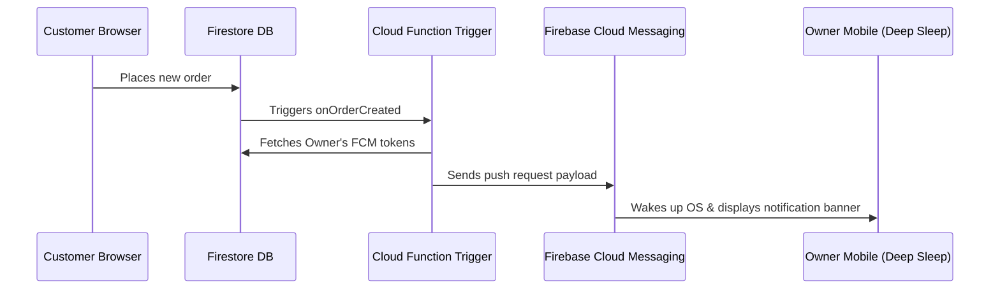

# Deep-Sleep Mobile Push Notifications Architecture

When a mobile device (Android or iOS) goes to sleep, the operating system suspends JavaScript execution and web socket connections (including Firestore's real-time sync listeners) to save battery. As a result, **local client-side notifications cannot fire in deep sleep**.

To receive notifications when the phone is asleep or the app is closed, you must implement **server-side Push Notifications** using **Firebase Cloud Messaging (FCM)**.

---

## FCM Push Notifications Flow



---

## Step-by-Step Implementation Guide

### 1. Server-Side: Firebase Cloud Function Trigger
Add a background trigger in your Cloud Functions (`functions/src/index.ts`) that listens for new orders and pushes them to FCM:

```typescript
import * as functions from "firebase-functions";
import * as admin from "firebase-admin";

export const sendNewOrderPushNotification = functions.firestore
  .document("restaurants/{restaurantId}/orders/{orderId}")
  .onCreate(async (snap, context) => {
    const order = snap.data();
    const restaurantId = context.params.restaurantId;

    try {
      // 1. Fetch restaurant details to find the owner ID
      const restaurantSnap = await admin.firestore().collection("restaurants").doc(restaurantId).get();
      if (!restaurantSnap.exists) return;
      const restaurantData = restaurantSnap.data()!;
      const ownerId = restaurantData.ownerId;
      if (!ownerId) return;

      // 2. Fetch the owner's registered FCM tokens
      const userSnap = await admin.firestore().collection("users").doc(ownerId).get();
      if (!userSnap.exists) return;
      const userData = userSnap.data()!;
      const fcmTokens: string[] = userData.fcmTokens || [];
      if (fcmTokens.length === 0) return;

      // 3. Construct the push payload
      const payload: admin.messaging.MulticastMessage = {
        tokens: fcmTokens,
        notification: {
          title: `New Order (Table ${order.tableNumber || "Takeaway"}) 🛎️`,
          body: `${order.customerName || "Customer"} ordered ${order.items.length} item(s) for ${restaurantData.currency || "₹"}${order.totalAmount}`,
        },
        android: {
          notification: {
            sound: "default",
            clickAction: "FCM_PLUGIN_ACTIVITY",
            priority: "high",
          },
        },
        apns: {
          payload: {
            aps: {
              sound: "default",
              badge: 1,
            },
          },
        },
      };

      // 4. Send the message via FCM
      const response = await admin.messaging().sendEachForMulticast(payload);
      console.log(`Successfully sent push to ${response.successCount} devices.`);
      
      // Clean up dead/invalid tokens
      if (response.failureCount > 0) {
        const invalidTokens: string[] = [];
        response.responses.forEach((resp, idx) => {
          if (!resp.success && resp.error) {
            const code = resp.error.code;
            if (code === "messaging/invalid-registration-token" || code === "messaging/registration-token-not-registered") {
              invalidTokens.push(fcmTokens[idx]);
            }
          }
        });
        if (invalidTokens.length > 0) {
          await admin.firestore().collection("users").doc(ownerId).update({
            fcmTokens: admin.firestore.FieldValue.arrayRemove(...invalidTokens)
          });
        }
      }
    } catch (error) {
      console.error("FCM push notification error:", error);
    }
  });
```

---

### 2. Client-Side: Register FCM Tokens in the App
Add client-side push notification registration inside your React app (e.g. after a restaurant owner logs in).

First, install the Capacitor Push Notifications plugin:
```bash
npm install @capacitor/push-notifications
npx cap sync
```

Then register the owner's device token to Firestore:
```typescript
import { PushNotifications } from '@capacitor/push-notifications';
import { doc, updateDoc, arrayUnion } from 'firebase/firestore';
import { db } from '../firebase/config';

export async function registerPushNotifications(ownerId: string) {
  try {
    // Check and request permission
    let permStatus = await PushNotifications.checkPermissions();
    if (permStatus.receive === 'prompt') {
      permStatus = await PushNotifications.requestPermissions();
    }
    if (permStatus.receive !== 'granted') {
      console.warn("User denied push notification permission.");
      return;
    }

    // Register with Apple/Google push services
    await PushNotifications.register();

    // Listen for FCM registration token and save it to the owner's Firestore document
    PushNotifications.addListener('registration', async (token) => {
      const userRef = doc(db, 'users', ownerId);
      await updateDoc(userRef, {
        fcmTokens: arrayUnion(token.value)
      });
      console.log("FCM registration successful. Token saved.");
    });

    PushNotifications.addListener('registrationError', (err) => {
      console.error("Capacitor registration error:", err);
    });

  } catch (err) {
    console.error("Push registration setup failed:", err);
  }
}
```
